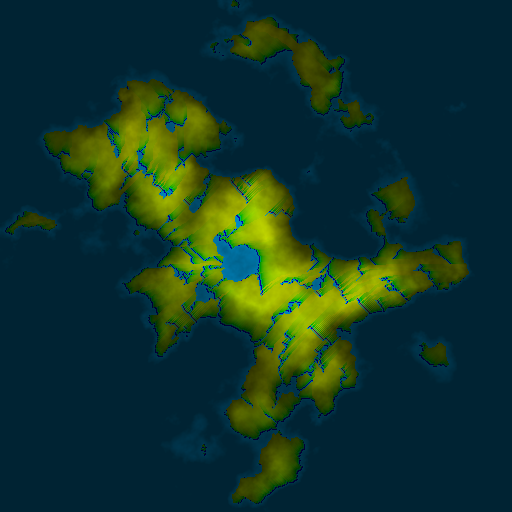
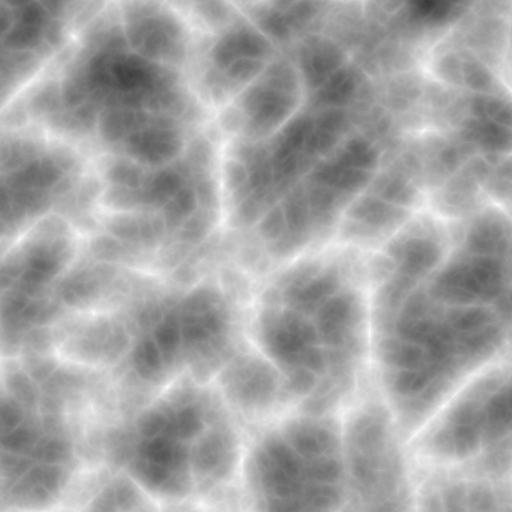
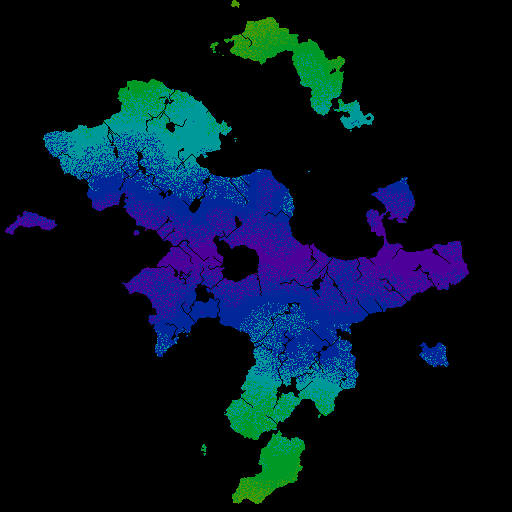
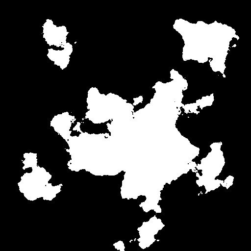
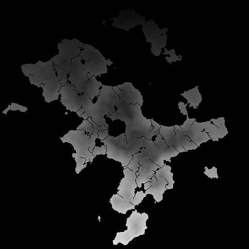
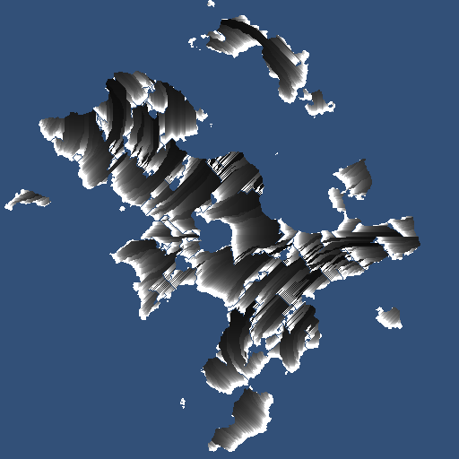
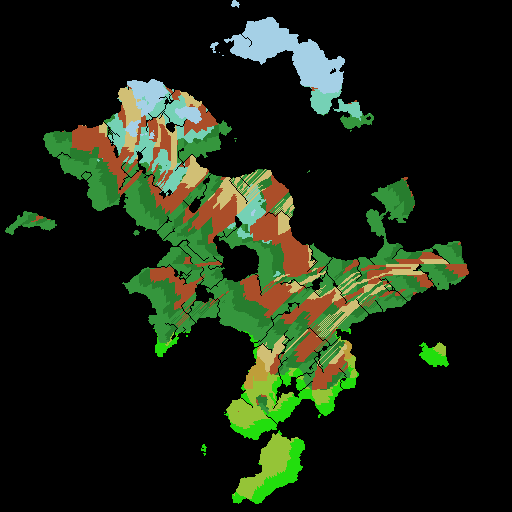

# continent-generator
A python project to create a (semi) realistic 2D continent map.

Perlin noise is used to create an initial height map, from which many other maps are generated and combined to create a finished map.

### Output

---
### Maps

> Height Map

> Wind Direction Map

> River/Lake/Ocean Map

> Temperature Map

> Rainfall Map

> Biome Map
